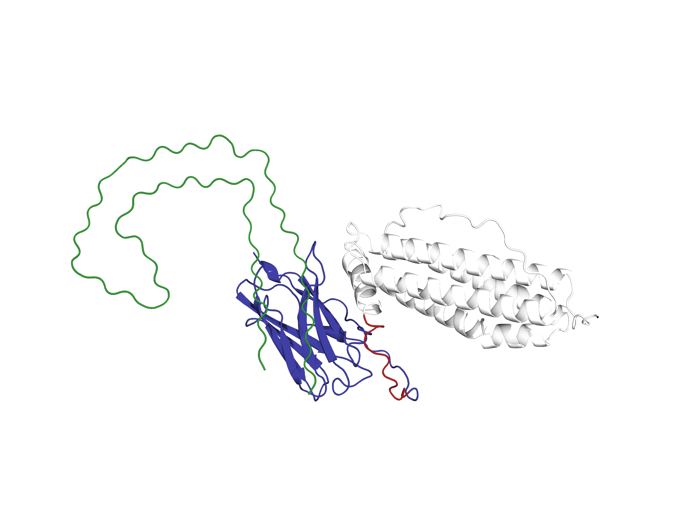

# Rational Design & Flexible Docking of an Anti-Seeding Ferritin-Nanobody Fusion Protein Targeting Tau Fibrils

This repository contains the computational framework, docking results, and gene optimization for an innovative **Anti-Seeding Molecular Platform** designed to inhibit Tau protein aggregation in Alzheimer's Disease.

## 🔬 Project Overview
The platform utilizes a **Ferritin nanocage** fused via a flexible linker to a specific **Nanobody** targeting the pathological seed of Tau fibrils (`5O3L`, Chain D). 

### Key Methodology:
* **Server:** HADDOCK 2.4
* **Refinement:** Semi-flexible docking with fully flexible linker regions (Residues 173–184: `(GGGGS)3`) to overcome the steric hindrance of the bulky Ferritin nanocage.
* **Target:** Side-wall interface of Tau fibrils (specifically masking the `VQIINK` motif).

## 📊 Key Results (Cluster 17 - Winner)
The flexible docking run successfully resolved the steric clashes observed in rigid-body models, leading to highly stable biophysical parameters:

* **HADDOCK Score:** -55.6 ± 11.7
* **Z-Score:** -2.3 (Statistically significant)
* **Electrostatic Energy:** -124.9 ± 11.7 kcal/mol (Strong driving force)
* **Van der Waals Energy:** -47.3 ± 3.5 kcal/mol
* **Buried Surface Area (BSA):** 1555.5 ± 98.3 Ų

## 🧬 Downstream Phase: Codon Optimization
The optimized fusion sequence was translated and codon-optimized for high-level expression in **Escherichia coli** (Host), ensuring the removal of critical restriction sites (`EcoRI`, `XhoI`, `NdeI`) for seamless wet-lab cloning.

## 📂 Repository Contents
* `/Structures`: Contains the top-ranking PDB structure (`cluster17_1.pdb`).
* `/Data`: Contains the comprehensive Excel matrix of all 10 HADDOCK clusters and the optimized DNA sequence for gene synthesis.

### 🎨 Molecular Color Mapping
To easily distinguish the components of this engineered fusion platform, the structure is color-coded as follows:
* ⬜ **White (Residues 1–172):** The **Ferritin subunit** (The nanocage carrier vehicle).
* 🟥 **Red (Residues 173–184):** The fully flexible **$(GGGGS)_3$ Linker** (Providing the biological elbow room).
* 🟦 **Blue (Residues 185–309):** The anti-aggregation **Nanobody** (The therapeutic weapon).
* 🟩 **Green (Chain B):** The pathological **Tau Fibril target** (The seed to be blocked).
